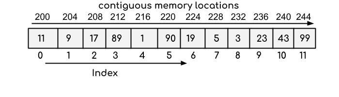

## Array:
An array is a collection of homogeneous (same type) data items stored in contiguous memory locations. For example if an array is of type “int”, it can only store integer elements and cannot allow the elements of other types such as double, float, char etc.

The syntax for declaring array are-

- data_type array_name [array_size];

## Basic Operations:
There is some specific operation that can be performed or those that are supported by the array. These are:
- Traversing: It prints all the array elements one after another.
- Inserting: It adds an element at given index.
- Deleting: It is used to delete an element at given index.
- Searching: It searches for an element(s) using given index or by value.
- Updating: It is used to update an element at given index.

## Advantages of using arrays: 

- Arrays allow random access to elements. This makes accessing elements by position faster.
- Arrays have better cache locality that makes a pretty big difference in performance.
- Arrays represent multiple data items of the same type using a single name.

## Disadvantages of using arrays: 
- You can’t change the size i.e. once you have declared the array you can’t change its size because of static memory allocation.

## Applications on Array

- Array stores data elements of the same data type.
- Arrays can be used for CPU scheduling.
Used to Implement other data structures like Stacks, Queues, Heaps, Hash tables, etc.