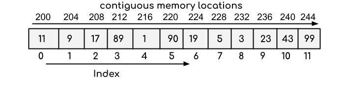

## Array:
An array is a collection of homogeneous (same type) data items stored in contiguous memory locations. For example if an array is of type “int”, it can only store integer elements and cannot allow the elements of other types such as double, float, char etc.

The syntax for declaring array are-

- data_type array_name [array_size];

## Basic Operations:
There is some specific operation that can be performed or those that are supported by the array. These are:
- Traversing: It prints all the array elements one after another.
- Inserting: It adds an element at given index.
- Deleting: It is used to delete an element at given index.
- Searching: It searches for an element(s) using given index or by value.
- Updating: It is used to update an element at given index.

## Advantages of using arrays: 

- Arrays allow random access to elements. This makes accessing elements by position faster.
- Arrays have better cache locality that makes a pretty big difference in performance.
- Arrays represent multiple data items of the same type using a single name.

## Disadvantages of using arrays: 
- You can’t change the size i.e. once you have declared the array you can’t change its size because of static memory allocation.

## Applications on Array

- Array stores data elements of the same data type.
- Arrays can be used for CPU scheduling.
Used to Implement other data structures like Stacks, Queues, Heaps, Hash tables, etc. 

## [How to increase the size of array](https://dotnettutorials.net/lesson/how-to-increase-size-of-an-array/)

## 2D Array : 
[2D array in C](https://www.geeksforgeeks.org/multidimensional-arrays-c-cpp/):  
The two-dimensional array can be defined as an array of arrays. The 2D array is organized as matrices which can be represented as the collection of rows and columns.  
The syntax to declare the 2D array is given below.
data_type array_name[rows][columns];   
### How to create Two Dimensional arrays:
Method 1 :  
<bold> int A[3][4]; //declaration </bold>  
<bold> int A[2][2]={{1,3},{4,6}}; //initialization </bold>

Method 2 :  
int *A[2];  
A[0]=new int[4];  
A[1]= new int[4];

Array of an element of an array say “A[ I ]” is calculated using the following formula: 
Address of A [ I ] = B + W * ( I – LB )
 Where,
B = Base address 
W = Storage Size of one element stored in the array (in byte) 
I = Subscript of element whose address is to be found 
LB = Lower limit / Lower Bound of subscript, if not specified assume 0 (zero) 
Example: 
Given the base address of an array B[1300…..1900] as 1020 and size of each element is 2 bytes in the memory. Find the address of B[1700]. 
Solution: 
The given values are: B = 1020, LB = 1300, W = 2, I = 1700 
Address of A [ I ] = B + W * ( I – LB ) 
= 1020 + 2 * (1700 – 1300)
 = 1020 + 2 * 400
 = 1020 + 800
 = 1820 

Address of an element of any array say “A[ I ][ J ]” is calculated in two forms as given:
(1) Row Major System (2) Column Major System
Row Major System: 
The address of a location in Row Major System is calculated using the following formula: 
Address of A [ I ][ J ] = B + W * [ N * ( I – Lr ) + ( J – Lc ) ] 
Column Major System: 
The address of a location in Column Major System is calculated using the following formula: 
Address of A [ I ][ J ] Column Major Wise = B + W * [( I – Lr ) + M * ( J – Lc )]
 Where,
 B = Base address
 I = Row subscript of element whose address is to be found
 J = Column subscript of element whose address is to be found
 W = Storage Size of one element stored in the array (in byte)
 Lr = Lower limit of row/start row index of matrix, if not given assume 0 (zero)
 Lc = Lower limit of column/start column index of matrix, if not given assume 0 (zero)
 M = Number of row of the given matrix
 N = Number of column of the given matrix

## Two - Dimensional Array :
A two dimensional Array A is the collection of 'm X n' elements. Programming language stores the two dimensional array in one dimensional memory in either of two ways -
1) Row Major Order:
First row of the array occupies the first set of memory locations reserved for the array; Second row occupies the next set, and so forth. 
To determine element address A[i,j]:   
    Location ( A[ i,j ] ) =Base Address + ( N x ( I - 1 ) ) + ( j - 1 )
  For example :
Given an array [1…5,1…7] of integers. Calculate address of element T[4,6], where BA=900.
  Solution:-  
         I = 4 , J = 6 ,M= 5 , N= 7
          Location (T [4,6]) = BA + (7 x (4-1)) + (6-1)
          = 900+ (7 x 3) +5
          = 900+ 21 + 5
          = 926
1) Column Major Order:
Order elements of first column stored linearly and then comes elements of next column.
To determine element address A[i,j]:
      Location ( A[ i,j ] ) =Base Address + ( M x ( j - 1 ) ) + ( i - 1 )
  For example :
Given an array [1…6,1…8] of integers.   Calculate address element T[5,7], where BA=300.
  Solution:- I = 5 , J = 7, M= 6 , N= 8
          Location (T [4,6]) = BA + (6 x (7-1)) + (5-1)
          = 300+ (6 x 6) +4
          = 300+ 36+4
          = 340
